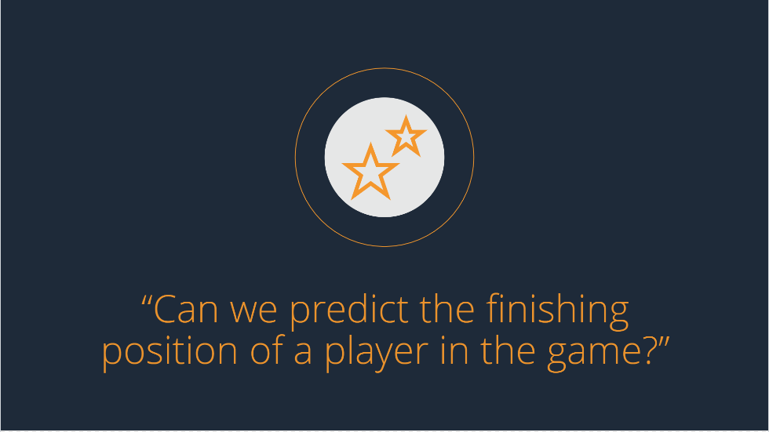
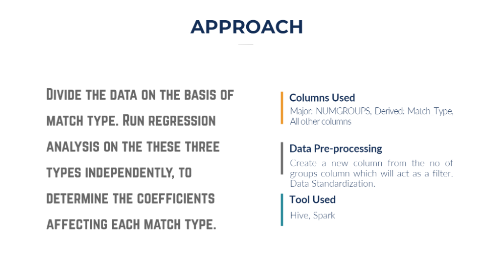
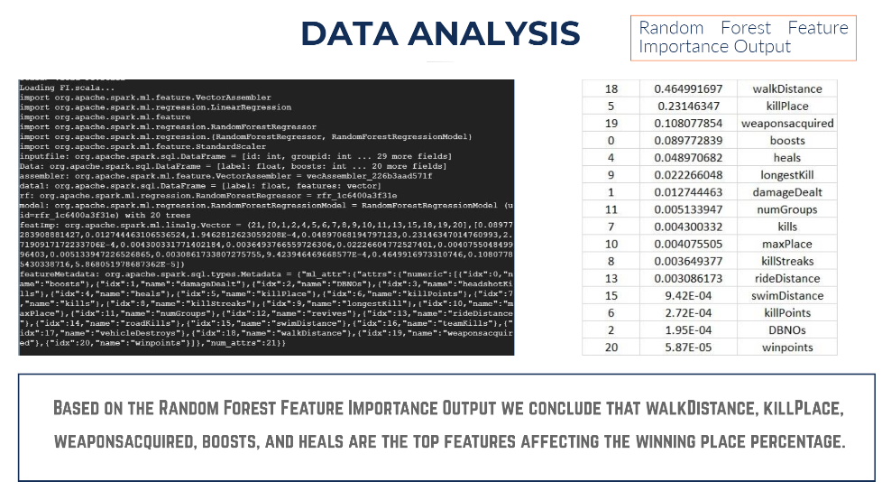

# Player Unknown's Battle Grounds (PUBG) Game Data Analysis 
> An analysis of Player Unknown's Battle Grounds (PUBG) Game Data using Hive and Spark. The project was done as part of Big Data Analysis class at the University of Texas at Dallas.
The final presentation for the report can be found in [project presentation](https://github.com/harshbg/PUBG/blob/master/Big%20Data%20Project%20-%20Group%207-%20Final.pdf).

## Table of contents
* [General info](#general-info)
* [Screenshots](#screenshots)
* [Technologies and Tools](#technologies-and-tools)
* [Setup](#setup)
* [Code Examples](#code-examples)
* [Features](#features)
* [Status](#status)
* [Contact](#contact)

## General info

The goal of the study was to learn data analysis using various big data tools. The professor had allowed us to select the dataset of our own choice to analyze.
All the members of our team were a great fan of PUBG mobile game and the game developer had recently released the dataset on Kaggle. So we decided to take it up for our project, that way we also have an analytics edge when playing the game. 

## Screenshots





## Technologies and Tools
* Hive
* Spark 

## Setup
The data for the analysis has been sourced from [Kaggle](https://www.kaggle.com/c/pubg-finish-placement-prediction). 
All the codes used in the analysis can be accessed [here](https://github.com/harshbg/PUBG/tree/master/Code) and can be used to reproduce the result. 
A detailed explanation of the various operations and the interpretations of the outputs can be found in the [project report](https://github.com/harshbg/PUBG/blob/master/Big%20Data%20Project%20-%20Group%207-%20Final.pdf).

## Code Examples

````
#Correlation in Hive
set hive.cli.print.header=true;
select corr(weaponsacquired,winplaceperc) from pubg_new where match_type1='solo';
select corr(weaponsacquired,winplaceperc) from pubg_new where match_type1='Duo';
select corr(weaponsacquired,winplaceperc) from pubg_new where match_type1='Squad'
````

````
#Clusterin in Scala
import org.apache.spark.ml.feature.VectorAssembler
import org.apache.spark.ml.classification.LogisticRegression
import org.apache.spark.mllib.evaluation.BinaryClassificationMetrics
import org.apache.spark.mllib.regression.LabeledPoint
import org.apache.spark.mllib.util.MLUtils
import org.apache.spark.ml.classification.BinaryLogisticRegressionSummary
import org.apache.spark.ml.clustering.KMeans
import org.apache.spark.ml.evaluation.ClusteringEvaluator


val inputfile = sql("select * from pubg_new")
val Data=inputfile.select(inputfile("winorlose").as("label"),$"boosts",$"damageDealt",$"DBNOs",$"headshotKills",$"heals",$"killPlace",$"killPoints",$"kills",$"killStreaks",$"longestKill",$"maxPlace",$"numGroups",$"revives",$"rideDistance",$"roadKills",$"swimDistance",$"teamKills",$"vehicleDestroys",$"walkDistance",$"weaponsacquired",$"winpoints",$"winorlose",$"winquartiles")

val assembler = new VectorAssembler().setInputCols(Array("boosts","damageDealt","DBNOs","headshotKills","heals","killPlace","killPoints","kills","killStreaks","longestKill","maxPlace","numGroups","revives","rideDistance","roadKills","swimDistance","teamKills","vehicleDestroys","walkDistance","weaponsacquired","winpoints","winorlose","winquartiles")).setOutputCol("features")
val data1 = assembler.transform(Data).select($"label",$"features")
val kmeans = new KMeans().setPredictionCol("cluster").setFeaturesCol("features").setK(5).setInitSteps(40).setMaxIter(99) 
val kmodel = kmeans.fit(data1)
println(s"3,${kmodel.computeCost(data1)}") 
println("Cluster centroids:")
kmodel.clusterCenters.foreach(println)
println(s"$3,${kmodel.computeCost(data1)}")
val predictions = kmodel.summary.predictions
predictions.orderBy("cluster").show()
predictions.count()
````

````
#Feature Importance
import org.apache.spark.ml.feature.VectorAssembler
import org.apache.spark.ml.regression.LinearRegression
import org.apache.spark.ml.feature
import org.apache.spark.ml.regression.RandomForestRegressor
import org.apache.spark.ml.regression.{ RandomForestRegressor, RandomForestRegressionModel }
import org.apache.spark.ml.feature.StandardScaler
val inputfile = sql("select * from pubg_new")
val Data=inputfile.select(inputfile("winplaceperc").as("label"),$"boosts",$"damageDealt",$"DBNOs",$"headshotKills",$"heals",$"killPlace",$"killPoints",$"kills",$"killStreaks",$"longestKill",$"maxPlace",$"numGroups",$"revives",$"rideDistance",$"roadKills",$"swimDistance",$"teamKills",$"vehicleDestroys",$"walkDistance",$"weaponsacquired",$"winpoints")
val assembler = new VectorAssembler().setInputCols(Array("boosts","damageDealt","DBNOs","headshotKills","heals","killPlace","killPoints","kills","killStreaks","longestKill","maxPlace","numGroups","revives","rideDistance","roadKills","swimDistance","teamKills","vehicleDestroys","walkDistance","weaponsacquired","winpoints")).setOutputCol("features")
val data1 = assembler.transform(Data).select($"label",$"features")


val rf = new RandomForestRegressor
val model: RandomForestRegressionModel = rf.fit(data1)
// GET FEATURE IMPORTANCE
val featImp = model.featureImportances
val featureMetadata = data1.schema("features").metadata
````
````
#Regression
import org.apache.spark.ml.feature.VectorAssembler
import org.apache.spark.ml.regression.LinearRegression
import org.apache.spark.ml.feature
import org.apache.spark.ml.feature.StandardScaler
val inputfile = sql("select * from pubg_new")
val Data=inputfile.select(inputfile("winplaceperc").as("label"),$"boosts",$"damageDealt",$"DBNOs",$"headshotKills",$"heals",$"killPlace",$"killPoints",$"kills",$"killStreaks",$"longestKill",$"maxPlace",$"numGroups",$"revives",$"rideDistance",$"roadKills",$"swimDistance",$"teamKills",$"vehicleDestroys",$"walkDistance",$"weaponsacquired",$"winpoints",$"winorlose")
val assembler = new VectorAssembler().setInputCols(Array("boosts","damageDealt","DBNOs","headshotKills","heals","killPlace","killPoints","kills","killStreaks","longestKill","maxPlace","numGroups","revives","rideDistance","roadKills","swimDistance","teamKills","vehicleDestroys","walkDistance","weaponsacquired","winpoints","winorlose")).setOutputCol("features")
val data1 = assembler.transform(Data).select($"label",$"features")
val scaler = new StandardScaler().setInputCol("features").setOutputCol("scaledFeatures").setWithStd(true).setWithMean(false)
val scalerModel = scaler.fit(data1)
val scaledData = scalerModel.transform(data1)
scaledData.show() 20, False
scaledData.show(Int.MaxValue)
scaledData.show(20, false)

val lr = new LinearRegression()
val lrModel = lr.fit(scaledData)
println(s"Coefficients: ${lrModel.coefficients} Intercept: ${lrModel.intercept}")
val trainingSummary = lrModel.summary
println(s"numIterations: ${trainingSummary.totalIterations}")
println(s"objectiveHistory: ${trainingSummary.objectiveHistory.toList}")
trainingSummary.residuals.show()
println(s"RMSE: ${trainingSummary.rootMeanSquaredError}")
println(s"MSE: ${trainingSummary.meanSquaredError}")
println(s"r2: ${trainingSummary.r2}")
````

## Features
The analysis is focussed on answering questions stated below:
  * Does killing more people increases the chance of winning the game?
  * Can we predict the finishing position of a player in the game?
  * Can we predict the winner of the game?
  * How different/similar are the strategies required to win the game when playing solo, duo, or in a group?
  * How do we catch the cheaters in the game?
  * How does the weapon acquisition strategy differ for players in different clusters?

The answers to the questions can be found in the [report](https://github.com/harshbg/PUBG/blob/master/Big%20Data%20Project%20-%20Group%207-%20Final.pdf). 

## Status
Project is: _finished_

## Contact
Created by me and my teammates [Siddharth Oza](https://github.com/siddharthoza) and [Devarsh Patel](https://github.com/Devarsh-UTD).

If you loved what you read here and feel like we can collaborate to produce some exciting stuff, or if you
just want to shoot a question, please feel free to connect with me on <a href="hello@gupta-harsh.com" target="_blank">email</a>, 
<a href="https://www.linkedin.com/in/harshbg/" target="_blank">LinkedIn</a>, 
or <a href="https://twitter.com/harshbg" target="_blank">Twitter</a>. 
My other projects can be found [here](http://www.gupta-harsh.com/projects/).

